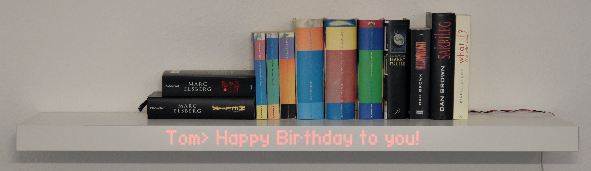
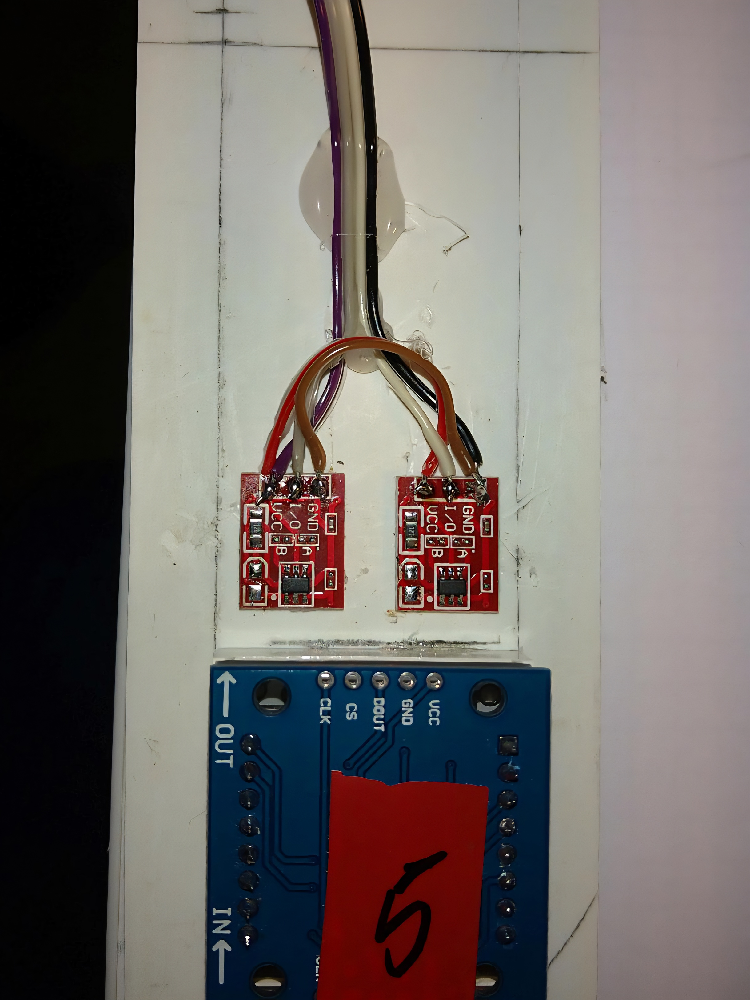
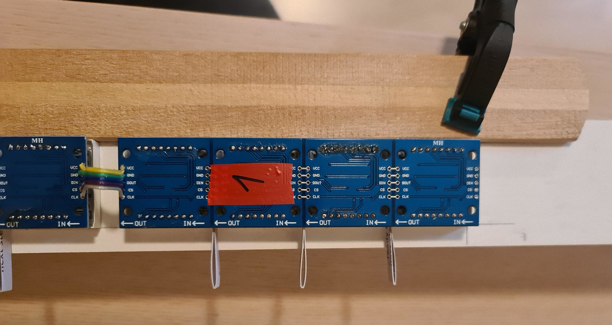
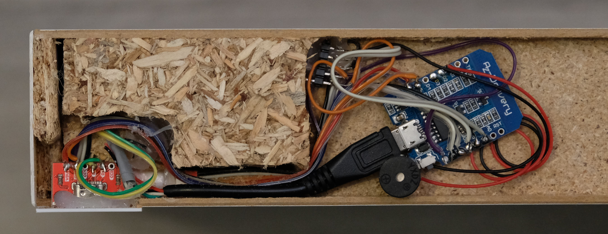
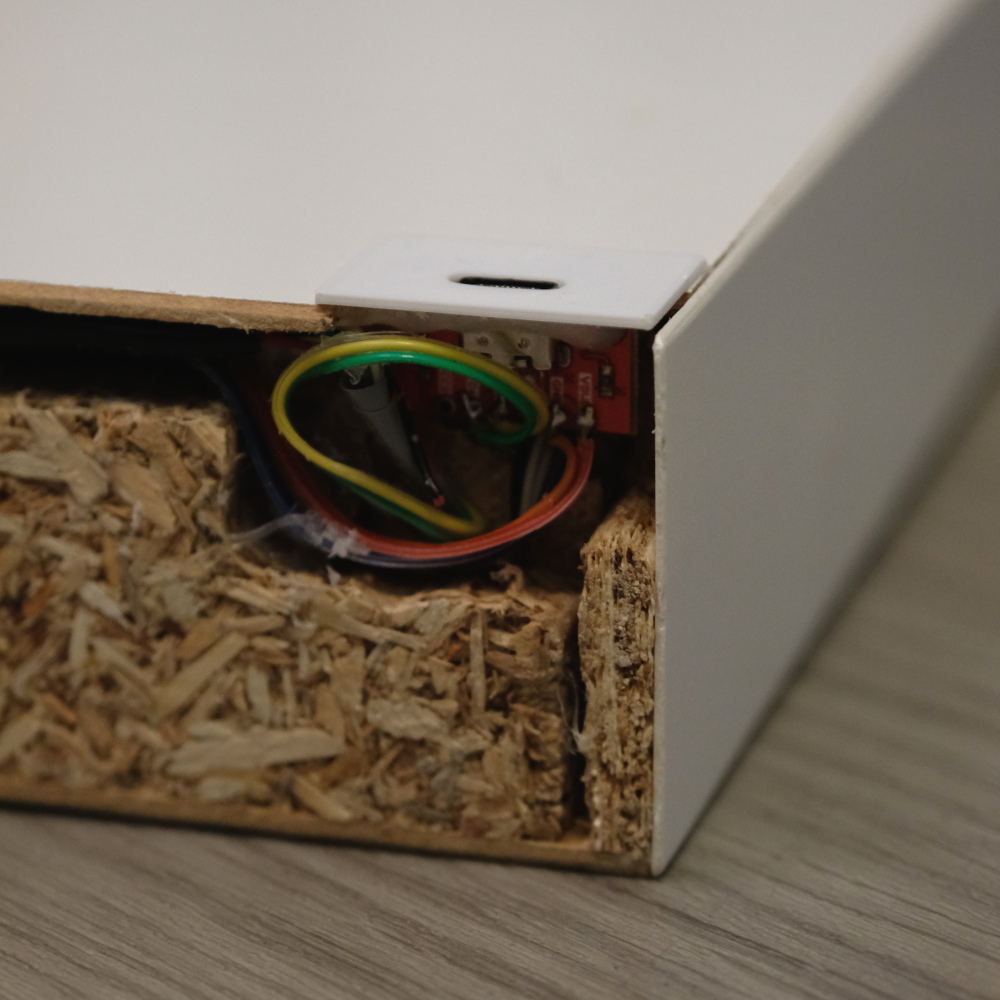

# remote-regal

In diesem Repo finden sich Informationen zu unserem IKEA-Lack-Regal Mod. 

Wir haben unter das Furnier der Frontseite eines IKEA-Regalbodens eine Reihe LED-Matrizen eingesetzt, um das Regal als verstecktes Display zu nutzen. Hierfür haben wir 4 [LED-Matrixelemente](https://www.az-delivery.de/en/products/4-x-64er-led-matrix-display?variant=6015286214683) hintereinander geschaltet und so ein Display mit 8x128 Pixeln erstellt.

# Aufbau

## Erster Test: Reicht die Helligkeit der LEDs?

## Kapazitive Sensoren und LED-Matrix

Die Interaktion mit dem Regal kann kontaktlos über zwei kapazitive Sensoren erfolgen.
Diese haben wir zusammen mit den LED-Matrix-Elementen auf die Innenseite des Funiers geklebt.

Beim sauberen Aufkleben hilft eine Latte als Anschlag

## Wemos und USB-C Port auf der Rückseite des Regals

# Stromversorgung

Wir haben ein USB-C Breakout genutzt zur Stromversorgung des Regals eingesetzt.

## Informationen zur Konfiguration

Die $V_{BUS}$-Versorgungsleitung eines USB-C Kabels ist standardmäßig spannungsfrei. Das ist grundsätzlich anders als bei USB-A oder USB-B Verbindungen. 
Damit USB-C Netzteile eine Spannung ausgeben, muss diesem über einen sogenannten CC (Configuration Channel) mittgeteilt werden, das ein Gerät angeschlossen ist. Um eine Spannung von 5V zu erhalten, reichen zwei 5.1kOhm Widerstände zwischen CC1/CC2 und GND.
Diese sind praktischerweise auf den USB-C Breakout Boards, die wir verwendet haben, direkt verbaut.

## Abdeckung des Ports

Den USB-C Port haben wir mit einer kleinen 3D-gedruckten Abdeckung in Regalfarbe versehen. So ist die Buchse ordentlich im Regal versteckt.

- [Inventor Datei](/3D-Druck/USB-C_Blende.ipt)
- [step Datei](/3D-Druck/USB-C_Blende.stp)

